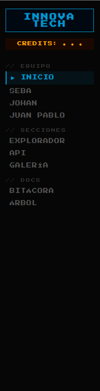
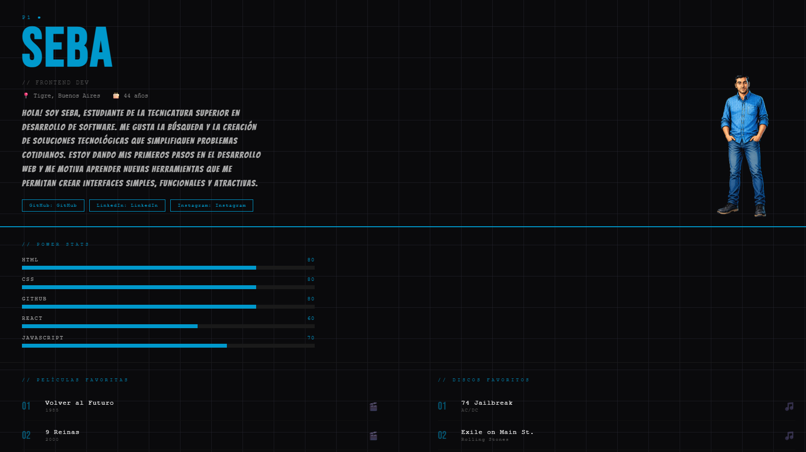
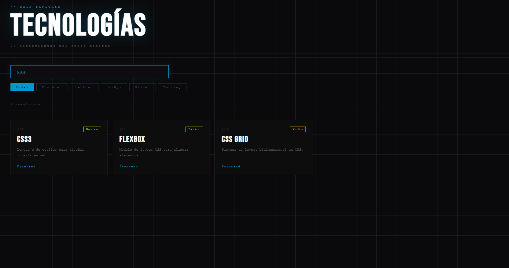
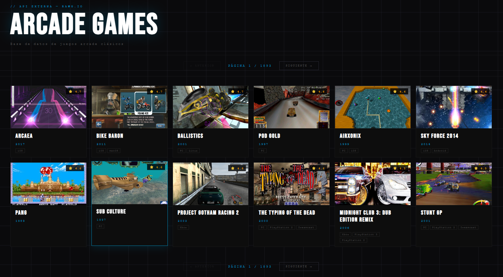
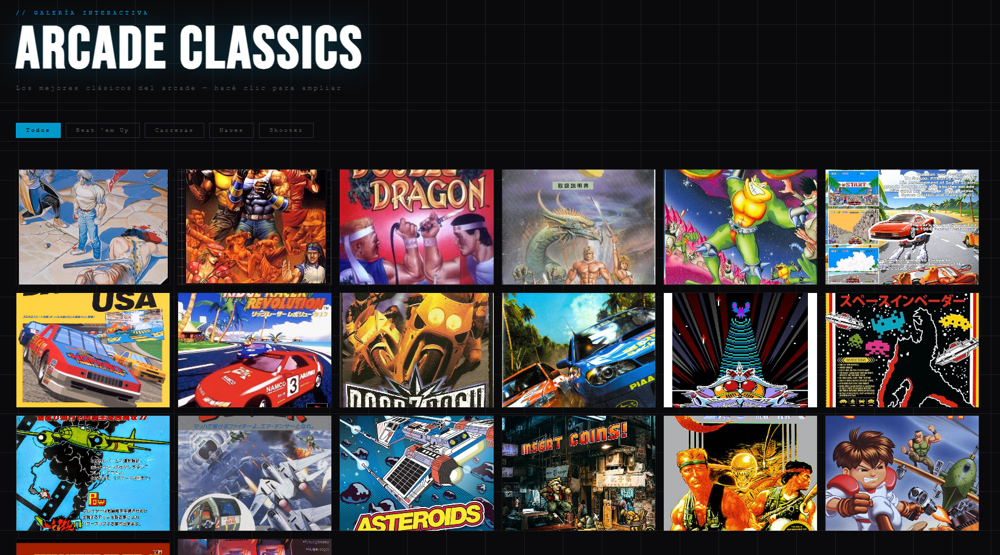
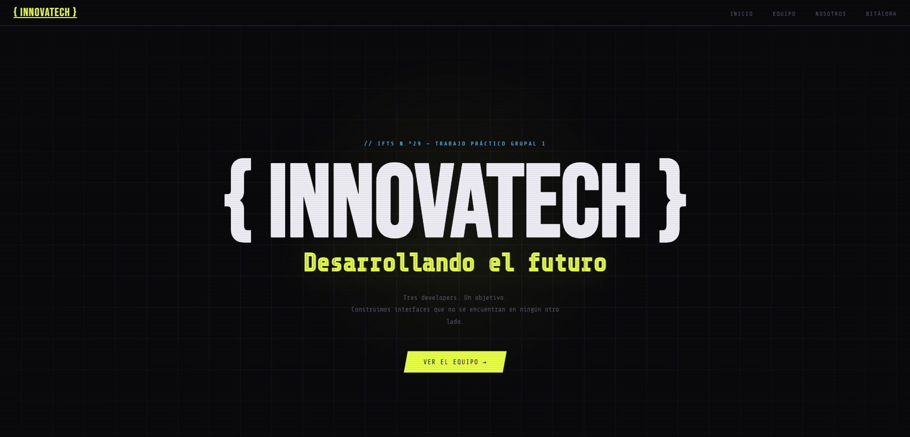
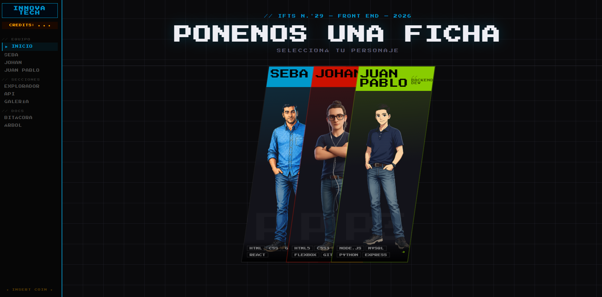
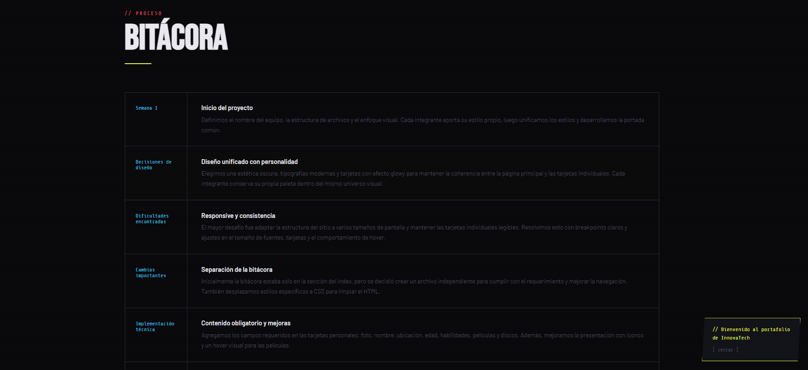
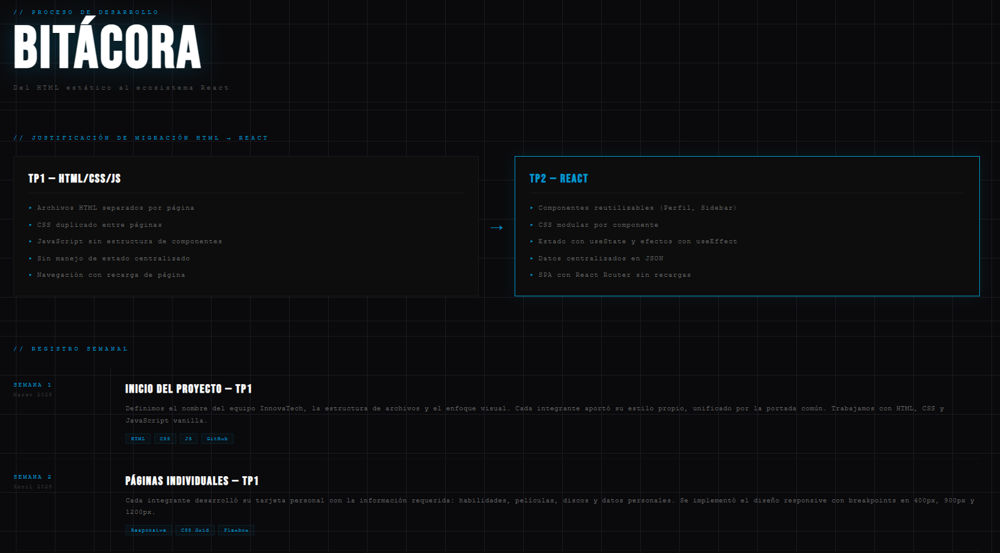
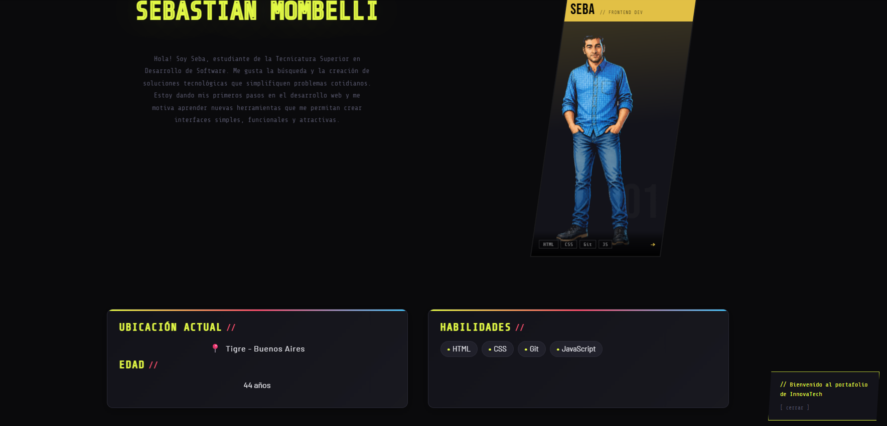

# 🕹️ InnovaTech — TP2 React

> **Deploy en Vercel:** [https://tp2-innovatech.vercel.app](https://tp2-innovatech.vercel.app)

---

## 📋 Descripción

InnovaTech es una single page desarrollada con React como evolución del TP1 (HTML/CSS/JS vanilla). La pagina presenta al equipo de trabajo mediante una interfaz con estética arcade que incluye perfiles individuales, explorador de datos con búsqueda en tiempo real, consumo de API externa con paginación, galería interactiva con lightbox, bitácora de proyecto y árbol de componentes.

---

## 👥 Integrantes

| Nombre | GitHub |
|---|---|
| Sebastián Mombelli | [@Seba2107](https://github.com/Seba2107) |
| Johan Matamoros | [@j-pablo89](https://github.com/j-pablo89) |
| Juan Pablo Miranda | [@ikolniath](https://github.com/ikolniath) |

---

## 🛠️ Tecnologías Utilizadas

| Tecnología | Uso |
|---|---|
| React | Librería principal de UI |
| Vite | Bundler y entorno de desarrollo |
| React Router DOM | Navegación SPA entre rutas |
| React Icons 5 | Iconografía del tech stack |
| Google Fonts | Tipografías del proyecto |
| RAWG.io API | API externa de videojuegos |
| Vercel | Deploy y hosting |
| GitHub | Control de versiones |

---

## 📁 Estructura de Archivos

```
tp2-innovatech/
├── public/
│   └── galeria/              # Imágenes de personajes y galería
├── src/
│   ├── assets/               # Recursos estáticos (svg, png)
│   ├── components/
│   │   ├── ArcadeIntro.jsx   # Pantalla de inicio animada
│   │   ├── ArcadeIntro.css
│   │   ├── Perfil.jsx        # Componente reutilizable de perfil
│   │   ├── Perfil.css
│   │   ├── Sidebar.jsx       # Navegación lateral fija
│   │   └── Sidebar.css
│   ├── data/
│   │   ├── integrantes.js    # Datos de los 3 integrantes
│   │   ├── tecnologias.js    # JSON con 20 tecnologías
│   │   └── galeria.js        # Datos de la galería de imágenes
│   ├── pages/
│   │   ├── Home.jsx / .css         # Dashboard principal
│   │   ├── PageSeba.jsx            # Perfil Sebastián
│   │   ├── PageJohan.jsx           # Perfil Johan
│   │   ├── PageJuanPablo.jsx       # Perfil Juan Pablo
│   │   ├── Explorador.jsx / .css   # Explorador de datos JSON
│   │   ├── Api.jsx / .css          # Módulo de API externa
│   │   ├── Galeria.jsx / .css      # Galería con Lightbox
│   │   ├── Bitacora.jsx / .css     # Bitácora del proyecto
│   │   └── Arbol.jsx / .css        # Árbol de renderizado
│   ├── App.jsx               # Componente raíz + rutas
│   ├── App.css
│   ├── index.css             # Estilos globales + Google Fonts
│   └── main.jsx              # Punto de entrada de React
├── index.html
├── package.json
├── vite.config.js
└── README.md
```

---

## 🎨 Guía de Estilos

### Paleta de Colores

| Rol | Hex |
|---|---|
| Fondo global | `#0a0a0c` |
| Acento Sebastián (P1) | `#0099cc` |
| Acento Johan (P2) | `#cc1100` |
| Acento Juan Pablo (P3) | `#88cc00` |

### Tipografías (Google Fonts)

| Fuente | Uso | Link |
|---|---|---|
| [Press Start 2P](https://fonts.google.com/specimen/Press+Start+2P) | Títulos y UI principal | Estética pixel art |
| [Bangers](https://fonts.google.com/specimen/Bangers) | Nombres y encabezados grandes | Impacto visual |
| [Share Tech Mono](https://fonts.google.com/specimen/Share+Tech+Mono) | Textos de código y labels | Estética terminal |

### Iconografía

Librería **React Icons v5** — se utilizan íconos de los sets `Si` (Simple Icons) y `Fa` (Font Awesome) para representar tecnologías en los perfiles de cada integrante.

---

## ⚛️ JavaScript / React — Funciones y Componentes Clave

### `ArcadeIntro.jsx`
Pantalla de bienvenida con animación de zoom y texto arcade. Usa `useState` para controlar si se muestra o no antes de renderizar la app principal.

```jsx
const [started, setStarted] = useState(false)
if (!started) return <ArcadeIntro onStart={() => setStarted(true)} />
```

### `Sidebar.jsx`
Navegación lateral fija con `NavLink` de React Router. Aplica clase `active` automáticamente a la ruta actual. Menú jerarquizado en secciones: Equipo, Secciones y Docs.



### `Perfil.jsx` — Componente reutilizable
Componente genérico que recibe un integrante como prop y renderiza su perfil completo. Usa `useEffect` para disparar la animación de las barras de habilidades con un delay de 200ms.


```jsx
useEffect(() => {
  const timer = setTimeout(() => setBarrasAnimadas(true), 200)
  return () => clearTimeout(timer)
}, [])
```



### `Explorador.jsx` — Filtrado en tiempo real
Filtra dinámicamente el JSON de 20 objetos combinando búsqueda por texto y filtro por categoría.

```jsx
const filtrados = tecnologias.filter((t) => {
  const coincideTexto = t.nombre.toLowerCase().includes(busqueda.toLowerCase())
  const coincideCategoria = categoriaActiva === 'Todas' || t.categoria === categoriaActiva
  return coincideTexto && coincideCategoria
})
```



### `Api.jsx` — Consumo de API externa
Consume la API de RAWG.io con `useEffect` + `fetch` asíncrono. Maneja tres estados: carga (`loading`), error (`error`) y datos. Incluye paginación con Anterior/Siguiente e indicador de página actual.



### `Galeria.jsx` — Lightbox interactivo
Galería en grid con lightbox que soporta zoom, navegación entre imágenes y cierre con tecla `ESC` mediante `onKeyDown`.

```jsx
const handleKey = (e) => {
  if (e.key === 'Escape') cerrarLightbox()
  if (e.key === 'ArrowRight') navegar(1)
  if (e.key === 'ArrowLeft') navegar(-1)
}
```



---

## 🚀 Enlace al Proyecto Desplegado

🔗 [https://tp2-innovatech.vercel.app](https://tp2-innovatech.vercel.app)

---

## 📈 Evolución del Proyecto

### TP1 → TP2: Migración a React

| Aspecto | TP1 (HTML/CSS/JS) | TP2 (React + Vite) |
|---|---|---|
| Estructura | Archivos HTML separados | Componentes reutilizables |
| Navegación | Links entre páginas | React Router (SPA) |
| Estado | Variables JS globales | `useState` / `useEffect` |
| Datos | Hardcodeados en HTML | Archivos `.js` de datos centralizados |
| Deploy | Vercel (archivos estáticos) | Vercel (build de Vite) |

**Justificación de la migración:** La arquitectura de componentes de React permitió eliminar la duplicación de código (el HTML de cada perfil era casi idéntico), centralizar los datos en un único archivo `integrantes.js` y gestionar el estado de UI (lightbox, filtros, paginación) de forma declarativa y predecible.

### Cambios y mejoras incorporadas en TP2
- ✅ Intro animada estilo arcade como pantalla de bienvenida
- ✅ Sidebar fija con navegación jerárquica
- ✅ Componente `Perfil` reutilizable para los 3 integrantes
- ✅ Explorador de datos con búsqueda + filtros en tiempo real
- ✅ Integración de API externa (RAWG.io) con paginación
- ✅ Galería con lightbox, navegación por teclado y cierre con ESC
- ✅ Bitácora técnica del proceso de desarrollo
- ✅ Árbol de renderizado de la arquitectura React

---

### Capturas que se consideran mejoras

- Portada con Sidebar lateral

### ANTES



### DESPUES




- Seccion Bitacoras

### ANTES



### DESPUES



- Perfil

### ANTES



### DESPUES


---

## 🤖 Uso de Inteligencia Artificial

### Herramientas utilizadas

| Herramienta | Uso |
|---|---|
| ChatGPT (OpenAI) | Asistencia en código, debugging y generación de contenido |
| DALL-E (OpenAI) | Generación de avatares de los personajes |

### Uso en contenido y código

- **Textos:** Se utilizó ChatGPT para refinar las descripciones de los integrantes y el contenido de la Bitácora del proyecto.
- **Lógica y debugging:** Se consultó para resolver problemas puntuales como el manejo del evento `onKeyDown` en el lightbox y la lógica de filtrado combinado en el Explorador.
- **Estructura:** Se usó como referencia para definir la arquitectura de componentes y la separación de responsabilidades entre páginas y componentes reutilizables.

### Imágenes — Avatares de personajes

Los avatares de los tres integrantes fueron generados con **DALL-E** (OpenAI). Se utilizaron prompts orientados a estética de videojuego arcade beat'em up, con paleta de colores oscura y estilo de personaje de fighting game, personalizados para cada integrante según su color identificatorio en la app.

> **Nota:** La IA fue utilizada como herramienta de asistencia. El diseño visual, la arquitectura del proyecto, la lógica de componentes y las decisiones técnicas fueron tomadas y ejecutadas por el equipo.
